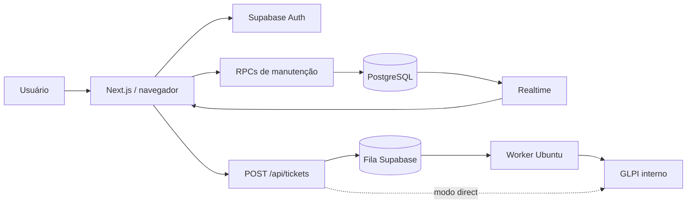

# Arquitetura e contratos

[Voltar ao índice](../README.md)

## Componentes e fluxo

Next.js App Router serve as páginas e a API. O navegador consulta o Supabase com a sessão do usuário. PostgreSQL guarda status e histórico. RPCs alteram ambos na mesma transação. A API Next.js enfileira chamados ou comunica diretamente com GLPI. No modo fila, um worker Node.js na rede interna faz o envio.



O padrão “Iceberg” é parcialmente aplicado: status e histórico usam RPCs atômicas. A view de resumo existe no SQL, mas o dashboard lê `pc_status` e agrega no cliente. Gravar a manutenção e enfileirar o chamado são operações separadas.

## Stack no lockfile inspecionado

| Pacote | Versão |
| --- | --- |
| Next.js | 15.5.18 |
| React | 19.2.6 |
| TypeScript | 5.9.3 |
| Tailwind CSS | 3.4.19 |
| @supabase/supabase-js | 2.105.4 |
| @supabase/ssr | 0.5.2 |

`package.json` usa intervalos; `npm ci` reproduz o lockfile. Lucide fornece ícones. Estilos e animações estão em CSS/Tailwind.

## Mapa do código

| Caminho | Responsabilidade |
| --- | --- |
| `src/app/layout.tsx` | Metadados, CSS global, idioma pt-BR |
| `src/app/(dashboard)/layout.tsx` | Composição com AppShell |
| `src/components/AppShell.tsx` | Navegação, tema, perfil e logout |
| `src/components/MaintenanceModal.tsx` | Relato, resolução e solicitação GLPI |
| `src/lib/constants.ts` | Inventário, motivos e tipos |
| `src/lib/supabase/client.ts` | Cliente do navegador, reutilizado no browser |
| `src/lib/supabase/server.ts` | Cliente de servidor com cookies |
| `src/lib/supabase/middleware.ts` | Sessão e autorização de rotas |
| `src/lib/auth/authorization.ts` | Listas de e-mails/domínios |
| `src/lib/glpi.ts` | Cliente GLPI direto |
| `scripts/glpi-worker.mjs` | Consumo da fila |
| `generate-sql.js` | INSERT inicial dos 320 PCs |
| `supabase-setup.sql` | Banco principal |
| `add-roles.sql` | Variante de perfis; incompatibilidade conhecida |
| `supabase-glpi-queue.sql` | Fila e reserva atômica |
| `next.config.mjs` | Cabeçalhos HTTP |
| `tailwind.config.js`, `src/app/globals.css` | Tema, estilos e impressão |

## Rotas

| Método/rota | Função |
| --- | --- |
| GET `/login` | Login por matrícula e senha; opção CCI por e-mail |
| GET `/auth/callback` | Troca `code` por sessão, redireciona para `next` local |
| GET `/` | Dashboard |
| GET `/lab/[id]` | Laboratório; `?pc=` seleciona um PC |
| GET `/historico` | Histórico |
| GET `/scanner` | Câmera e entrada manual |
| GET `/admin/qrcodes` | Etiquetas; exige admin; runtime declarado edge |
| POST `/api/tickets` | Fila ou envio direto |

O grupo `(dashboard)` não compõe a URL. O middleware exclui recursos estáticos e certas extensões de imagem. Redireciona visitantes sem sessão para login, encerra sessões com e-mail não autorizado e verifica perfil em `/admin`. A API também verifica usuário e e-mail.

Para professores, `src/lib/auth/matricula.mjs` converte os seis dígitos em alias Auth e verifica metadados administrativos. `isUserAuthorized` combina essa verificação com as listas CCI. `scripts/prepare-teachers.py` prepara a lista privada e `scripts/import-teachers.mjs` executa o cadastro. Veja [Cadastro de professores](CADASTRO-PROFESSORES.md).

## Contrato POST /api/tickets

Requer sessão por cookies. Exemplo:

```json
{
  "title": "Manutenção: LAB100 (Lab 1) - Não liga",
  "description": "Computador não liga. Verificar alimentação."
}
```

Os campos devem ser strings não vazias após `trim`. São truncados em 160 e 4.000 caracteres. O solicitante é obtido da sessão. Não há chave de idempotência, ID de manutenção ou PC estruturado no contrato.

| Resultado do handler | HTTP | Campos principais |
| --- | --- | --- |
| Enfileirado | 200 | success, queued, message |
| Criado diretamente | 200 | success, ticketId, message |
| Sessão/e-mail recusado | 401 | error |
| Campos ausentes | 400 | error |
| Erro na fila | 500 | error, stage=queue, details |
| Erro GLPI | 500 | error, stage, status, endpoint |
| Exceção/JSON inválido | 500 | error |

O middleware pode redirecionar antes do handler; uma requisição sem sessão nem sempre recebe JSON 401.

`GLPI_DELIVERY_MODE` assume `queue`. Qualquer valor diferente é tratado pelo código como envio direto; use explicitamente `queue` ou `direct`.

## GLPI

Os clientes abrem `/initSession` com App-Token e User-Token, enviam `POST /Ticket` com Session-Token e tentam `/killSession` ao final. O chamado usa urgência, impacto e prioridade 3 por padrão, `type: 1` e `requesttypes_id: 1`. A equipe deve conferir esses valores na instalação GLPI.

O navegador limita a espera pela API a seis segundos. Cancelar a espera não garante cancelamento no servidor. O worker não define timeout explícito para chamadas GLPI.

O worker reserva um item por execução via RPC, envia e registra o ID retornado. O intervalo padrão é dez segundos, com cinco tentativas. Como usa `setInterval` assíncrono, execuções podem se sobrepor. Há limitações de recuperação e duplicidade descritas em [Pendências](PENDENCIAS.md).

## Realtime e cabeçalhos

Dashboard e laboratório assinam mudanças em `pc_status`, com nova consulta após debounce de 500 ms. O laboratório filtra por `lab_id`. O histórico não assina eventos.

Cabeçalhos configurados: `X-Frame-Options: DENY`, `X-Content-Type-Options: nosniff`, `Referrer-Policy: strict-origin-when-cross-origin` e `Permissions-Policy` com câmera própria, sem microfone/geolocalização.
